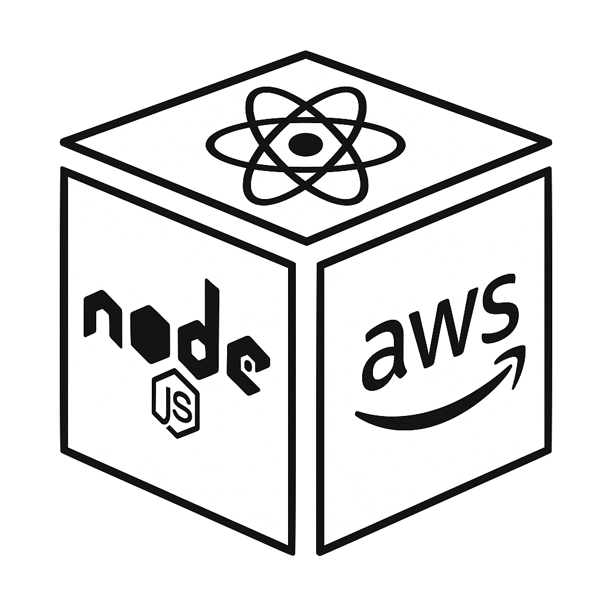

<p align="center">
  
</p>

### The ultimate boilerplate for modern fullstack development.

# Tech Stack

<p align="center">
  
</p>

## Table of Contents

- [Overview](#overview)
- [Quickstart](#quickstart)
- [Setup](#setup)
  - [Pull code and install dependencies](#pull-code-and-install-dependencies)
  - [AWS authentication](#aws-authentication)
  - [Domain](#domain)
  - [Email](#email)
  - [Secrets](#secrets)
- [AWS Build and Deploy](#aws-build-and-deploy)
  - [Docker](#docker)
  - [ECR](#ecr)
  - [Update Cloudformation and Scripts](#update-cloudformation-and-scripts)
  - [Build Cloudformation stacks and deploy code](#build-cloudformation-stacks-and-deploy-code)
  - [Deleting Cloudformation stacks](#deleting-cloudformation-stacks)
- [Local Development](#local-development)
  - [Env variables](#env-variables)
  - [Start Server in dev mode](#start-server-in-dev-mode)
  - [Build and Start Server in production mode](#build-and-start-server-in-production-mode)
  - [local subdomain](#local-subdomain)
- [Misc](#misc)
  - [Email Templating - MJML](#email-templating---mjml)
  - [Favicons](#favicons)
- [OpenSearch Integration (optional)](#opensearch-integration-optional)
  - [Create and deploy opensearch server](#create-and-deploy-opensearch-server)
  - [Create bastion host and SSH tunnel](#create-bastion-host-and-ssh-tunnel)
  - [Setup dictionary search](#setup-dictionary-search)
- [Elasticache integration (optional)](#elasticache-integration-optional)

# Overview

Simple and clean foundation for production quality web applications.

Minimal dependencies, with usage of web standard apis.

Featuring modern frontend, and connection to AWS cloud ecosystem, with IAC via Cloudformation.

# Quickstart

- Create an AWS account and go through [#AWS authentication](#secrets)
- Generate your [#secrets](#secrets), you can skip email.
- Create a DynamoDB called `email-type`, with PK=email (string), SK=type (string)
- Create a S3 called `react-node-aws-assets`
- Copy `.env.sample` into a newly created `.env`
- [#Pull code and install dependencies](#pull-code-and-install-dependencies)
- [#Start Server in dev mode](#start-server-in-dev-mode)

When transitioning from local development to production deployment, make sure to delete your S3 and DynamoDB to give Cloudformation a clean slate.

# Setup

### Pull code and install dependencies

```
> git clone git@github.com:dtonys/react-node-aws.git
> cd react-node-aws.git
> nvm use 24
> npm install
```

### AWS authentication

Create a user in IAM and give it `AdministratorAccess`, this user will be used to develop locally.

Create an access and secret key for the AWS CLI. Install the CLI and use the keys to authenticate.

```
> brew install awscli
> aws configure
```

Update your `.zshrc` or equivalent.

> export AWS_PROFILE=\<your-user\>

### Domain

Purchase a domain and setup the DNS records in Route 53.

### Email

Signup for resend to integrate your email - https://resend.com/

Setup your domain name with resend, update your route 53 with email records.

### Secrets

In AWS Secrets Manager, add a secret named `web-secrets` with your session and resend key.

```
SESSION_ENCRYPTION_KEY={secret}
RESEND_API_KEY={secret}
```

Use the following script to generate SESSION_ENCRYPTION_KEY:

> node src/scripts/generateSecret.js

# AWS Build and Deploy

AWS resources and deployment will be handled by CloudFormation. You'll need to do a few manual steps before deploying.

### Docker

Make sure you have docker desktop installed to be able to build docker image.

Run the npm script to test your docker build

> npm run docker:build

### ECR

Create a repo on ECR. The deploy scripts will connect to ECR, tag your local docker image with the ECR repo and commit hash, and then push it up to the ECR.

### Update Cloudformation and Scripts

Visit route53 and VPC via the AWS console to plug in the variables. We will be using the default VPC and Route53 variables that are already there in your account.

You can keep the stack name, certs, and other params defaulted as `react-node-aws`.

The snippet below shows the minimum configs you need to update. Replace the hardcoded values with the ones connected to your AWS account.

NOTE: Remove the OPENSEARCH_ENDPOINT until you have gone through [#Opensearch integration](##opensearch-integration-optional)

```
// infra/deploy-server.sh
ECR_REPO=964744224338.dkr.ecr.us-west-1.amazonaws.com/react-node-aws

// infra/cloudformation.yml, update the `DEFAULT` value for each,
DomainName=react-node-aws.com
HostedZoneId=Z061643331OITX7Z4V6YL
VpcId=vpc-06340a61
PublicSubnet1=subnet-f36b6ea8
PublicSubnet2=subnet-4cef062a
```

### Build Cloudformation stacks and deploy code

Run the scripts in order

Create certs for ECS and Cloudfront assets. This only needs to be done once.

> ./infra/create-cert.sh

Create ECS Stack, build & deploy latest docker image.

> npm run deploy:server

Build assets and copy to S3.

> npm run deploy:client

On completion, your app should be deployed to production:
https://www.react-node-aws.com/

You can also run the app locally now that your dynamoDB has been created.

To deploy to both the server and client:

> npm run deploy

### Deleting Cloudformation stacks

You can delete a stack via the Cloudformation console. However, that will not remove all resources with delete protection enabled. So make sure to delete resources manually, otherwise Cloudformation will run into "resource already exists" errors when creating the stack again.

# Local Development

### Env variables

Create and populate a `.env` file. See `.env.sample` has been provided.

The .env will not be used in production, make sure to add new variables to the `Environment` section in your `TaskDefinition`, inside the cloudformation.yml.

### Start Server in dev mode

Start API and frontend server in separate terminal tabs.

> npm run server:watch

> npm run webpack:watch

Nativate to localhost:8080 on the web browser to see the frontend webapp.

Hit APIs on localhost:3000 on the web browser or postman client to test the APIs.

### Build and Start Server in production mode

Build server and client, run locally

> npm run server:build

> npm run webpack:build

> npm run server:start

Build Docker image, run on docker.

> npm run docker:build

> npm run docker:run

When building prod version, your app be will availble on localhost:3000

### local subdomain

In order to support domain based cookies, you will want to update your /etc/hosts to point localhost to your domain.

```
# /etc/hosts

127.0.0.1       dev.react-node-aws.com
```

# Misc

### Email Templating - MJML

MJML engine makes designing emails simple. You can design email templates via their online tool: https://mjml.io/try-it-live

This app ships with "Verify Email" and "Reset Password" which are vital for the authentication workflow.

### Favicons

Use https://favicon.io/favicon-converter/ to generate favicons across platforms.

Place your favicons in `src/client/images/favicons`. The webpack build will automatically copy them into the `/public` folder where they can be consumed by the browser.

# OpenSearch Integration (optional)

### Create and deploy opensearch server

OpenSearch is AWS's version of elastic search.

This setup is more complex and requires a bastion host to connect from your local env to the search cluster.

Build and deploy your opensearch server:

```
./infra/deploy-opensearch
```

After it is created, use the AWS cli to get the endpoint:

```
aws cloudformation describe-stacks \
  --stack-name react-node-aws-search \
  --region us-west-1 \
  --query 'Stacks[0].Outputs[?OutputKey==`OpenSearchDomainEndpoint`].OutputValue' \
  --output text
```

Plug it in to the OPENSEARCH_ENDPOINT in your main stack.

### Create bastion host and SSH tunnel

Create a SSH key pair:

```
aws ec2 create-key-pair \
  --key-name react-node-aws-key \
  --region us-west-1 \
  --query 'KeyMaterial' \
  --output text > ~/.ssh/react-node-aws-key.pem

chmod 400 ~/.ssh/react-node-aws-key.pem
```

Build and deploy your bastion server:

```
./infra/deploy-bastion.sh
```

Run a SSH tunnel locally, in the background, the script should provide this command for you.

```
ssh -i ~/.ssh/${KeyPairName}.pem -L 9243:OPENSEARCH_ENDPOINT:443 -N -f ec2-user@${BastionEIP}
```

Use `ps aux | grep ssh` to find and kill your tunnel if needed.

Now add a security group to opensearch to allow connection from bastion host:

```
# Get the bastion security group ID
BASTION_SG=$(aws cloudformation describe-stack-resources \
  --stack-name react-node-aws-bastion \
  --region us-west-1 \
  --query "StackResources[?LogicalResourceId=='BastionSecurityGroup'].PhysicalResourceId" \
  --output text)

# Get the OpenSearch security group ID
OPENSEARCH_SG=$(aws cloudformation describe-stack-resources \
  --stack-name react-node-aws-search \
  --region us-west-1 \
  --query "StackResources[?LogicalResourceId=='OpenSearchSecurityGroup'].PhysicalResourceId" \
  --output text)

# Add rule allowing bastion to access OpenSearch
aws ec2 authorize-security-group-ingress \
  --group-id $OPENSEARCH_SG \
  --protocol tcp \
  --port 443 \
  --source-group $BASTION_SG \
  --region us-west-1
```

You can test the setup by SSHing to your bastion host and hitting the opensearch server.

```
ssh -i ~/.ssh/react-node-aws-key.pem ec2-user@52.9.9.158
curl -k https://vpc-react-node-aws-search-v5nreaaujr74farkujqfnlaya4.us-west-1.es.amazonaws.com
```

On hitting the curl command, you should get a response like this:

```
{"Message":"User: anonymous is not authorized to perform: es:ESHttpGet because no resource-based policy allows the es:ESHttpGet action"}
```

This is good, this shows your bastion host can connect to the server.

Now you can test the opensearch by creating an index, adding a few documents, and searching for them.

Make sure the SSH tunnel is running before starting the server:

```
// Create index
curl -X POST http://localhost:3000/api/dictionary/create-index

// Insert documents
curl -X POST http://localhost:3000/api/dictionary/index \
  -H "Content-Type: application/json" \
  -d '{"word": "hello", "definition": "A greeting used to begin a conversation", "partOfSpeech": "interjection", "example": "Hello, how are you?"}'
curl -X POST http://localhost:3000/api/dictionary/index \
  -H "Content-Type: application/json" \
  -d '{"word": "world", "definition": "The earth and all its inhabitants", "partOfSpeech": "noun", "example": "She traveled the world."}'
curl -X POST http://localhost:3000/api/dictionary/index \
  -H "Content-Type: application/json" \
  -d '{"word": "apple", "definition": "A round fruit with red, green, or yellow skin", "partOfSpeech": "noun", "example": "She ate an apple for lunch."}'

// Search documents:
curl "http://localhost:3000/api/dictionary/search?q=hello"
curl "http://localhost:3000/api/dictionary/search?q=greeting"
curl "http://localhost:3000/api/dictionary/search?q=wrld"
```

Once deployed to production, you can search directly from the browser:

https://www.react-node-aws.com/api/dictionary/search?q=hello

### Setup dictionary search

Review https://github.com/CloudBytes-Academy/English-Dictionary-Open-Source.

Download this CSV into `data/dictionary.csv`: https://raw.githubusercontent.com/CloudBytes-Academy/English-Dictionary-Open-Source/main/csv/dictionary.csv

Then run the `src/scripts/importDictionary.ts` to populate the dictionary search index.

This will enable a set of V2 APIs which provide search, autocomplete, word lookup, and random word:

https://www.react-node-aws.com/api/v2/dictionary/word/dog

https://www.react-node-aws.com/api/v2/dictionary/search?q=happy&limit=10&offset=0

https://www.react-node-aws.com/api/v2/dictionary/autocomplete?q=hap&limit=10

https://www.react-node-aws.com/api/v2/dictionary/random

# Elasticache integration (optional)

Make sure your bastion instance is deployed. If not, do that first:

```
 ./infra/deploy-bastion.sh
```

Run the deploy script to create your elasticache cluster.

```
# 1. Deploy ElastiCache (takes 5-10 minutes)
./infra/deploy-elasticache.sh

# 2. Copy the REDIS_URL from the output

# 3. Update cloudformation.yml with the actual REDIS_URL value and uncomment it

# 4. Re-deploy the main stack
./infra/deploy-server.sh
```

After updating the main cloudformation with REDIS_URL, ensure your .env file is updated as well to point to the local endpoint:

```
 REDIS_URL=redis://localhost:6379
```

Then run an SSH tunnel to connect your local to the elasticache cluster:

```
ssh -i ~/.ssh/YOUR_KEY.pem -L 6379:react-node-aws-cache.1onrxo.0001.usw1.cache.amazonaws.com:6379 -N ec2-user@BASTION_IP
```

You can test the SSH tunnel and redis server by using the redis-cli:

```
redis-cli ping
```

# Lambda + event bridge integration (optional)

The lambda + cloudwatch are combined to create a featured called "Word of the Day" (wotd)

A daily schedule setup by eventbridge will run at 8 AM and execute a lambda function that will pull all subscribers and email them a random word from the dictionary service.

You can build and deploy the lambda by running the script

```
./infra/deploy-wotd.sh
```
